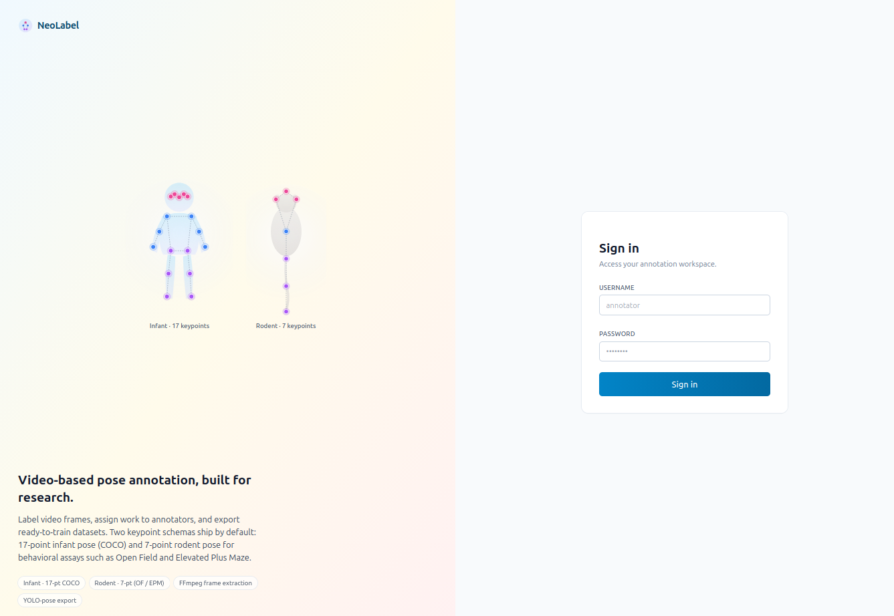
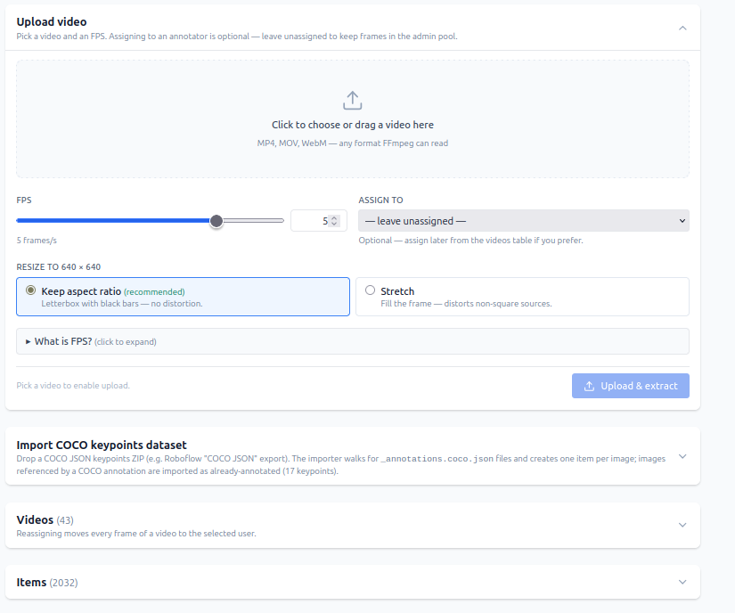
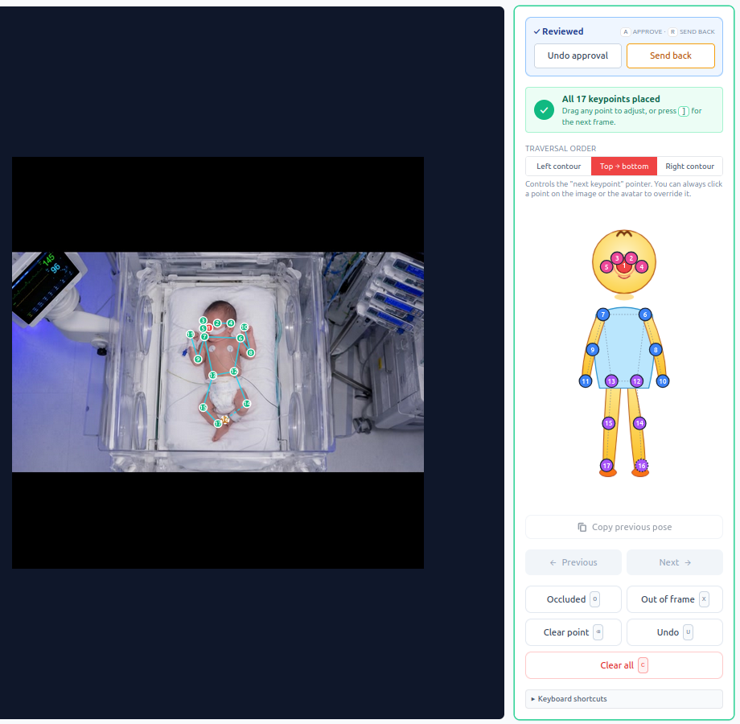

# NeoLabel

**Video-based pose annotation, built for research.**

Label video frames, assign work to annotators, and export ready-to-train
datasets. Two keypoint schemas ship by default: **17-point infant pose
(COCO)** and **7-point rodent pose** for behavioral assays such as
**Open Field (OF)** and **Elevated Plus Maze (EPM)**.

<p align="center">
  
  <br>
  <sub><em>Sign-in screen — the two default schemas and the supported workflow are surfaced right at the entry point.</em></sub>
</p>

> Full specification (domain model, API reference, roadmap) lives in
> **[SPEC.md](./SPEC.md)**.

## What you can do

NeoLabel covers the path from raw video to a trainable dataset in four
steps:

1. **Upload videos** at a chosen FPS — FFmpeg extracts the frames.
   Optionally resize to **640×640** (letterbox or stretch). Optionally
   **import an existing COCO keypoints dataset** to start from
   pre-annotated items.
2. **Assign work** — admins assign whole videos to a specific annotator
   or leave them in the admin pool. Per-user visibility is enforced;
   annotators only see what's assigned to them.
3. **Annotate** with mouse or full-keyboard workflow; auto-save on every
   action; undo history of 50 steps.
4. **Export** as JSON / JSONL / CSV, YOLO-pose ZIP
   (Ultralytics-ready, COCO 17 keypoints), or a full-bundle ZIP that
   includes every referenced frame for portability.

<p align="center">
  
  <br>
  <sub><em>Admin view of a project — upload videos, choose extraction FPS and resize policy, optionally assign to a user. The same screen also lets admins import an existing COCO keypoints dataset (e.g. a Roboflow export) as pre-annotated items.</em></sub>
</p>

## What gets annotated

Two ship-ready schemas, with room for new ones as needs arise:

- **Infant pose** — 17 COCO keypoints, with an interactive baby avatar
  on the right panel as a visual guide.
- **Rodent pose** — 7 keypoints (`N` nose, `LEar` / `REar` ears, `BC`
  body center, `TB` / `TM` / `TT` tail base / middle / tip), tailored
  for behavioral assays.

<p align="center">
  
  <br>
  <sub><em>Rodent keypoint schema currently in use.</em></sub>
</p>

## How annotation works

Each extracted frame becomes an **item** you walk through with keyboard
shortcuts. The right panel shows a live avatar of where you are in the
schema, the chosen traversal order, and the action buttons.

<p align="center">
  
  <br>
  <sub><em>Pose annotation UI. <strong>The frame above is AI-generated for documentation purposes — not a real subject.</strong> Using synthetic frames in public materials is the recommended way to demo annotation tools that target sensitive populations (infants, patients), since you keep informed-consent obligations clean while still showing the product accurately.</em></sub>
</p>

Key interactions:

- **Mouse or keyboard.** Arrows + Enter/Space to place a point;
  clicking directly on the image always overrides the pointer.
- **Shortcuts.** `Tab` / `N` next keypoint, `1`–`9` jump, `O` occluded,
  `X` out of frame (saved as COCO `v=0`), `U` undo, `[` / `]` previous
  / next item.
- **Traversal order.** Top-to-bottom (default), left-contour, or
  right-contour. Output array order is unchanged across modes — only
  the pointer behavior changes.
- **Reuse previous frame as template.** Optional toggle that prefills
  a new frame with the previous frame's keypoints, so you only drag
  to adjust. Safe to turn on/off mid-session.
- **Auto-save** on every action; **undo history** of 50 steps;
  per-point and clear-all reset.
- **Review states.** Items move through `pending → in-progress →
  reviewed`; reviewers can approve or send back.

## Roles

- **admin** — uploads videos, imports COCO datasets, assigns
  annotators, deletes projects and items. Destructive bulk operations
  are admin-only.
- **annotator** — sees and works on items assigned to them.
- **reviewer** — approves or sends back annotated items.

## Export

For pose projects:

| Format            | Includes pending? | Best for                                                                 |
| ----------------- | ----------------- | ------------------------------------------------------------------------ |
| JSON / JSONL / CSV | Yes (pending rows carry `annotation: null`) | Inspection, scripting, custom pipelines                  |
| YOLO-pose ZIP     | Annotated only   | Direct training with Ultralytics (COCO 17 keypoints)                     |
| Full bundle ZIP   | All items + every referenced source frame | Portable archive across machines, reproducibility       |

Downloads are streamed with a progress bar and are cancellable.

## Run it

The recommended path is **Docker** — bundles FFmpeg, pins Python/Node
versions, and mounts source code for hot-reload.

```bash
cp .env.example .env
cp seed_users.example.json seed_users.json
# edit seed_users.json with the credentials you want
docker compose up --build -d
```

Then open <http://localhost:5173>. The API and its OpenAPI docs are at
<http://localhost:8000/docs>.

`seed_users.json` is read on every backend startup:

- Listed users are **created** if they don't exist yet.
- If a listed user already exists, **password and role are reconciled**
  to match the file — so editing the password and restarting the
  backend rotates credentials.
- Users not listed are left untouched. To prune users that were
  removed, use the reconciliation script (see SPEC).

If you skip the file entirely, no users are created automatically — use
the register screen.

For a native (non-Docker) setup, see [SPEC.md](./SPEC.md). Requires
Python 3.12, Node 18+, and FFmpeg on `PATH`.

## Data

All runtime data lives under `./data/` (configurable via `DATA_DIR`).
Each project is a subfolder with its config, items, annotations,
uploaded videos, and extracted frames. **No database** — backup is just
copying that folder.

## Cite

If you use NeoLabel in academic work, please cite it. The "Cite this
repository" button on the GitHub page reads
[CITATION.cff](./CITATION.cff) and also offers an APA-style entry.
For BibTeX, copy the block below:

```bibtex
@software{maia_neolabel_2026,
  author  = {Maia, Helton and Tavares Filho, Marcos Aur{\'e}lio},
  title   = {{NeoLabel}: Video-based pose annotation for research},
  year    = {2026},
  version = {0.1.0},
  url     = {https://github.com/neolabel/app},
  license = {Apache-2.0}
}
```

## License

**[Apache License 2.0](./LICENSE)** — permissive open-source license,
allows both commercial and non-commercial use, with attribution.

Copyright (c) 2026 Helton Maia — <https://heltonmaia.com>

When redistributing: keep `LICENSE` and `NOTICE`, preserve copyright /
patent / trademark / attribution notices, and mark any modified files
as changed. Full terms:
[apache.org/licenses/LICENSE-2.0](https://www.apache.org/licenses/LICENSE-2.0).

## Authors

- **Helton Maia** — <helton.maia@ufrn.br> —
  [heltonmaia.com](https://heltonmaia.com)
- **Marcos Aurélio Tavares Filho**
